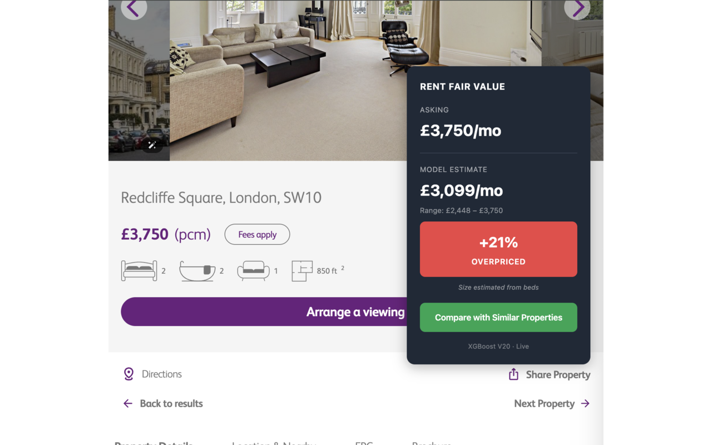
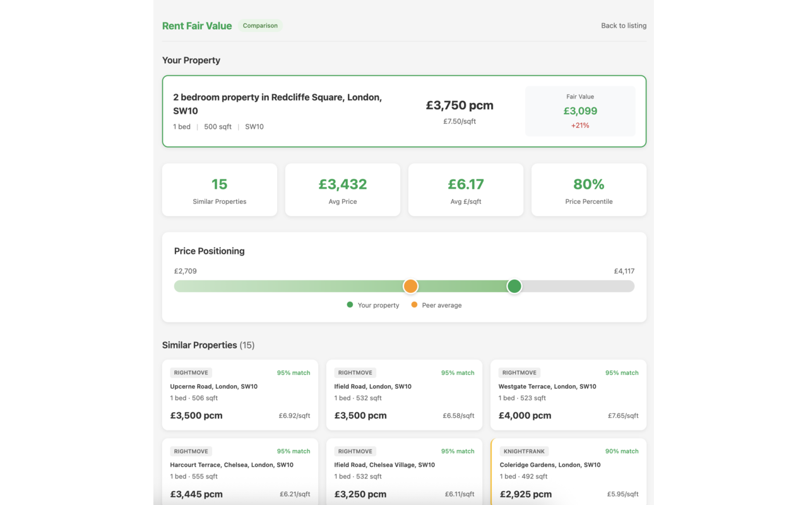

# Rent Fair Value

**Know if you're overpaying for rent in London — instantly.**

  

---

## What It Does

A Chrome extension that shows you the **fair market rent** for any London property listing.

When you visit a rental on Rightmove, Knight Frank, Chestertons, or Savills, a sidebar appears with:

- **Fair Value Estimate** — What similar properties rent for, based on 10,000+ listings
- **Premium/Discount %** — Whether the asking price is above or below market rate
- **Compare Similar** — Side-by-side view of comparable properties nearby

  

  

---

## Install (2 minutes)

1. **[Download the ZIP](https://github.com/kavanaghpatrick/rent-fair-value/releases/latest/download/rent-fair-value-v1.0.0.zip)**
2. Unzip the file
3. Open Chrome → `chrome://extensions`
4. Enable **Developer mode** (top right toggle)
5. Click **Load unpacked** → select the unzipped folder
6. Visit any rental listing on a supported site

### Supported Sites

- [Rightmove](https://www.rightmove.co.uk)
- [Knight Frank](https://www.knightfrank.co.uk)
- [Chestertons](https://www.chestertons.co.uk)
- [Savills](https://www.savills.com)

---

## How It Works

The extension uses an XGBoost model trained on 10,000+ London rental listings. It extracts property details (bedrooms, size, location) from the page and predicts fair market rent with 91% accuracy.

All processing happens locally in your browser — no data is sent to any server.

---

## Privacy

- No data collection
- No tracking
- No external API calls
- Open source — inspect the code yourself

[Full Privacy Policy](PRIVACY_POLICY.md)

---

## Support

[Open an issue](https://github.com/kavanaghpatrick/rent-fair-value/issues) for bugs or feature requests.
